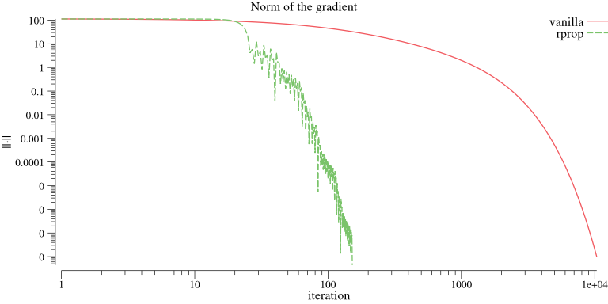

## Documentation

The documentation of this package can be found [here](https://godoc.org/github.com/pbenner/autodiff).

## Examples

### Differentiation

Compute the derivative of a function *f* at *x = 9*

```go
  import . "github.com/pbenner/autodiff"

  f := func(x Scalar) Scalar {
    return Add(Mul(NewReal(2), Pow(x, NewReal(3))), NewReal(4))
  }
  x := NewReal(9)
  Variables(1, x)
  y := f(x)
```
where *y.GetValue()* returns the function value and *y.Derivative()* the derivative at *x = 9*.

### Gradient descent

Compare vanilla gradient descent with resilient backpropagation
```go
  import . "github.com/pbenner/autodiff"
  import   "github.com/pbenner/autodiff/algorithm/gradientDescent"
  import   "github.com/pbenner/autodiff/algorithm/rprop"

  f := func(x Vector) Scalar {
    // x^4 - 3x^3 + 2
    return Add(Sub(Pow(x[0], NewReal(4)), Mul(NewReal(3), Pow(x[0], NewReal(3)))), NewReal(2))
  }
  x0 := NewVector(RealType, []float64{8})
  // vanilla gradient descent
  xn1, _ := gradientDescent.Run(f, x0, 0.0001, gradientDescent.Epsilon{1e-8})
  // resilient backpropagation
  xn2, _ := rprop.Run(f, x0, 0.0001, 0.4, rprop.Epsilon{1e-8})
```



### Matrix inversion

Compute the inverse *r* of a matrix *m* by minimizing the Frobenius norm *||mb - I||*
```go
  import . "github.com/pbenner/autodiff"
  import   "github.com/pbenner/autodiff/algorithm/rprop"

  m := NewMatrix(RealType, 2, 2, []float64{1,2,3,4})

  I := IdentityMatrix(2)
  r := matrix.Clone()
  // objective function
  f := func(x Vector) Scalar {
    r.SetValues(x)
    s := Mnorm(MsubM(MmulM(matrix, r), I))
    return s
  }
  x, _ := rprop.Run(f, r.Values(), 0.01, 0.1, rprop.Epsilon{1e-12})
  r.SetValues(x)
```

### Newton's method

Find the root of a function *f* with initial value *x0 = (1,1)*

```go
  import . "github.com/pbenner/autodiff"
  import   "github.com/pbenner/autodiff/algorithm/newton"

  f := func(x Vector) Vector {
    if len(x) != 2 {
      panic("Invalid input vector!")
    }
    y := MakeVector(2)
    // y1 = x1^2 + x2^2 - 6
    // y2 = x1^3 - x2^2
    y[0] = Sub(Add(Pow(x[0], NewReal(2)), Pow(x[1], NewReal(2))), NewReal(6))
    y[1] = Sub(Pow(x[0], NewReal(3)), Pow(x[1], NewReal(2)))

    return y
  }

  x0    := NewVector(RealType, []float64{1,1})
  xn, _ := newton.Run(f, x0, newton.Epsilon{1e-8})
```

### Minimize Rosenbrock's function using the BFGS algorithm

```go
  import . "github.com/pbenner/autodiff"
  import   "github.com/pbenner/autodiff/algorithm/bfgs"

  f := func(x Vector) (Scalar, error) {
     // f(x1, x2) = (a - x1)^2 + b(x2 - x1^2)^2
     // a = 1
     // b = 100
     // minimum: (x1,x2) = (a, a^2)
     a := NewReal(  1.0)
     b := NewReal(100.0)
     s := Pow(Sub(a, x[0]), NewReal(2.0))
     t := Mul(b, Pow(Sub(x[1], Mul(x[0], x[0])), NewReal(2.0)))
     return Add(s, t), nil
   }
   hook := func(gradient, x Vector, y Scalar) bool {
     fmt.Println("gradient:", gradient)
     fmt.Println("x       :", x)
     fmt.Println("y       :", y)
     return false
   }

   x0 := NewVector(RealType, []float64{-0.5, 2})
   bfgs.Run(f, x0,
     bfgs.Hook{hook},
     bfgs.Epsilon{1e-10})
```

