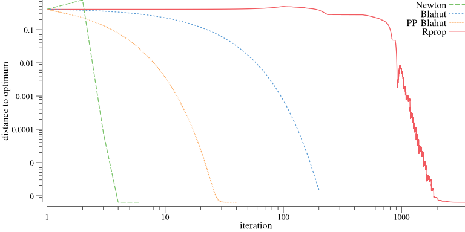

Find the capacity of a channel between *X* and *Y* by maximizing the mutual information

The gradient based approaches use the Lagrangian

where
- Newton's method is used to find the roots of the gradient
- Rprop minimized the squared norm of the gradient

