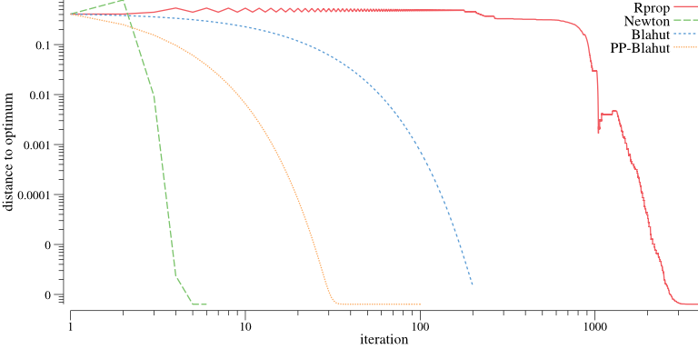

Find the capacity of a channel between *X* and *Y* by maximizing the mutual information
$$
  I_{\pi}(X;Y)
  =
  \sum_{x,y}
  p(x,y)
  \log
  \frac{p(x,y)}{p(x)p(y)}
  \ , \ 
  \text{where}
  \ 
  p(x,y) = p(y|x)\pi(x)
  \ .
$$

The gradient based approaches use the Lagrangian
$$
  \mathcal{L}(\pi, \lambda)
  =
  I_{\pi}(X;Y)
  +
  \lambda_0
  \left(
    \sum_x \pi(x) - 1
  \right)
  -
  \sum_{x\in I} \lambda_x \pi(x)
  \ ,
$$
where *I* is the active set of constraints. For the comparison
- Newton's method is used to find the roots of the gradient
- Rprop minimizes the squared norm of the gradient

